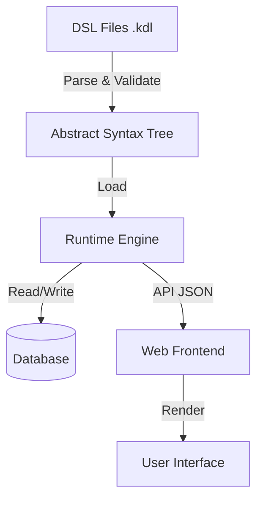

# Gurih Framework Documentation

## 1. Introduction

**Gurih Framework** is a DSL-driven application framework designed for building enterprise-grade systems, such as ERP (Enterprise Resource Planning) and government administration platforms. It solves the complexity of managing large-scale, rule-heavy applications by abstracting domain logic, workflows, and user interfaces into a unified, declarative Domain Specific Language (DSL).

Typical enterprise software development suffers from tight coupling between business logic and technical implementation. Changing a workflow rule often requires recompiling code, updating database schemas, and redeploying frontend assets. Gurih addresses this by moving the definition of the system into interpreted DSL files, allowing for:

*   **Rapid Iteration:** Changes to business rules or UI layouts are applied immediately by updating the DSL.
*   **Auditability:** The entire system specification is human-readable and version-controllable.
*   **Consistency:** The framework enforces standardized behaviors for common patterns like approvals, data validation, and auditing.

Typical use cases include Human Resource Management Systems (HRMS), Case Management, and complex Data Entry/Approval workflows.

## 2. Core Design Principles

### DSL-First Architecture
The DSL is not a configuration file; it is the source code of the business application. The framework treats the DSL as the primary definition of truth. The Rust runtime and Vue.js frontend are merely engines that interpret and render this definition.

### Declarative over Imperative
Developers describe *what* the system should do (e.g., "transitions from Draft to Pending require a document"), not *how* to do it (e.g., "query database, check if column is null, then update row"). This reduces bugs and ensures business intent is clear.

### Data-Driven UI
User Interfaces are generated from the data model and declarative layout definitions. While custom components are possible, the framework encourages using standard, data-bound components (Forms, Datatables, Dashboards) to maintain consistency and accessibility across the application.

### Separation of Concerns
Gurih enforces a strict separation between:
*   **Domain Rules:** Entity definitions and relationships.
*   **Workflow:** State transitions and permissions.
*   **UI Definition:** Layouts, pages, and menus.
*   **Execution Logic:** The Rust runtime handling side effects and persistence.

### Auditability & Determinism
Because the system behavior is defined in a structured DSL, it is possible to statically analyze the application for errors (e.g., broken links, missing permissions) before runtime. This also facilitates generating documentation or audit logs directly from the source.

## 3. High-Level Architecture

The framework consists of four main components:

1.  **Gurih DSL (Compiler & Parser):**
    *   Reads `.kdl` files.
    *   Parses them into an Abstract Syntax Tree (AST).
    *   Validates the AST for semantic correctness (e.g., checking that a workflow references a valid entity field).
    *   Produces a validated `Schema` structure.

2.  **Runtime Engine (`gurih_runtime`):**
    *   A Rust-based execution environment.
    *   Loads the `Schema` at startup.
    *   Handles HTTP requests, API endpoints, and authentication.
    *   Executes logic: validating data against entities, processing workflow transitions, and executing side effects (e.g., database updates, file storage).
    *   Abstracts the underlying data store (PostgreSQL, SQLite) and file storage (Local, S3).

3.  **Intermediate Representation (`gurih_ir`):**
    *   A shared set of type definitions and enums that acts as the contract between the DSL compiler and the Runtime engine.
    *   Ensures type safety across the boundary.

4.  **UI Rendering Pipeline (`web`):**
    *   A Single Page Application (SPA) built with Vue 3.
    *   Fetches UI metadata (layouts, forms, dashboards) from the Runtime API.
    *   Dynamically renders components based on this metadata.
    *   It does *not* contain hardcoded business rules; it purely reflects the state provided by the backend.

## 4. Gurih DSL Overview

Gurih uses **KDL (Key Document Language)** for its syntax. KDL is chosen for its superior readability, support for nested structures, and type-aware nodes, which fits well with hierarchical data modeling.

### Structure of a DSL File
A project is composed of multiple `.kdl` files which are merged into a single schema. The file extension is typically `.kdl`.

### Top-Level Constructs
*   `module`: logic grouping for entities and actions.
*   `entity`: Defines data models and relationships.
*   `workflow`: Defines state machines.
*   `page` / `dashboard`: Defines UI screens.
*   `menu`: Defines navigation.
*   `role` / `permission`: Defines access control.

### Namespacing and Scoping
Entities and Actions are often grouped within `module` blocks. References to these items must be resolved correctly. The compiler handles name resolution, allowing cross-module relationships (e.g., an Order in the `Sales` module referencing a Product in the `Inventory` module).

### Validation vs. Execution Phases
*   **Validation Phase:** Occurs at startup. The compiler checks for:
    *   Syntax errors.
    *   Broken references (e.g., `belongs_to "NonExistentEntity"`).
    *   Type mismatches in default values.
*   **Execution Phase:** Occurs at runtime. The engine enforces:
    *   Data integrity (unique constraints, required fields).
    *   Workflow preconditions (e.g., "is the document uploaded?").
    *   Permission checks.

## 5. DSL Execution Model

### Parsing and Loading
When the application starts, the `gurih_cli` or runtime server reads the directory containing `.kdl` files. It parses them all, merges them, and runs the validator. If validation fails, the application refuses to start, preventing invalid states.

### Data Binding & Validation
Runtime data (e.g., JSON from an API request) is bound to Entity definitions.
1.  **Coercion:** Incoming data is converted to the target types (e.g., string "2023-01-01" to Date object).
2.  **Validation:** The engine checks constraints like `required`, `min/max`, and regex patterns.
3.  **Persistence:** Validated data is stored in the configured DataStore.

### Side Effects & Workflow
Side effects are primarily handled via **Actions** and **Workflow Transitions**.
*   **Actions:** Defined sequences of steps (e.g., `entity:update`, `entity:delete`) triggered by API calls.
*   **Transitions:** When an entity changes state (e.g., `Draft` -> `Approved`), the Workflow Engine:
    1.  Checks **Preconditions** (e.g., `MinYearsOfService`, `Document` existence).
    2.  If passed, updates the state.
    3.  Executes **Effects** (e.g., `Notify`, `UpdateField`, `SuspendPayroll`).

### Error Handling
The framework creates a clear distinction between "System Errors" (500s, config issues) and "Business Logic Errors" (400s, validation failures). Workflow rejections return structured error messages explaining *why* a transition failed (e.g., "Missing required document: Diploma"), allowing the UI to display helpful feedback.

## 6. DSL & UI Integration

### The "Kitchen Sink" Concept
The frontend acts as a "kitchen sink" or "player" for the DSL. It knows how to render generic components (`Datatable`, `Form`, `Widget`) but doesn't know *what* they contain until it receives the schema from the backend.

### Props Mapping
DSL nodes map directly to Component props.
*   `field "description" type="textarea"` -> `<TextInput type="textarea" ... />`
*   `widget ... type="stat"` -> `<MetricCard ... />`

### Stateless Rendering
The UI fetches the page definition (layout, components) and the data separately. This ensures that the UI definition can be cached, while the data remains fresh. The frontend is largely stateless regarding business logic; it relies on the backend to tell it which transitions are available or which fields are editable.

## 7. Extending Gurih

### Adding a New DSL Construct
1.  **Define the Node:** Update `gurih_ir` to include the new type (e.g., a new `WidgetType`).
2.  **Update the Parser:** Modify `gurih_dsl/src/ast.rs` and the parser logic to recognize the new KDL node.
3.  **Implement Runtime Logic:** Update `gurih_runtime` to handle the new construct (e.g., if it's a backend logic piece).
4.  **Update UI (if applicable):** Update the frontend to render the new component based on the API response.

### Extending Runtime Behavior
New "Effects" or "Preconditions" for workflows require updating the `WorkflowEngine` in `gurih_runtime`. Currently, these are defined as Rust enums (`TransitionEffect`, `TransitionPrecondition`). To add a custom effect, one must add a variant to the enum and implement the handler in the runtime.

### Adding UI Components
New UI components should be added to `web/src/components`. They must be registered in the dynamic renderer (often a mapping of string types to Vue components). Components should be designed to be configurable via props driven by the DSL.

### Compatibility & Versioning Concerns
When extending the DSL or Runtime, consider version compatibility:
*   **DSL Changes:** Adding new optional nodes is backward-compatible. Removing or renaming nodes breaks existing projects and requires a migration script.
*   **Runtime API:** The `gurih_ir` schema defines the contract between backend and frontend. Changes to struct definitions here must be coordinated with updates to the frontend code.
*   **Database Schema:** The runtime automatically manages schema migrations for standard entity changes (e.g., adding a field). However, custom extensions that alter data storage strategies require manual migration handling.

## 8. Best Practices & Anti-Patterns

### Recommended Patterns
*   **Modularize:** Group related entities and workflows into named `module` blocks.
*   **Use Semantic Types:** Prefer specific types like `money`, `email`, `serial` over generic `string` or `int`.
*   **Explicit Workflows:** Define workflows for any entity that has a lifecycle. Do not rely on ad-hoc boolean flags for state.
*   **Role-Based Access:** Design permissions early using `role` blocks and assign them to routes.

### Common Mistakes
*   **Business Logic in UI:** Attempting to hide a button via CSS instead of using permissions or workflow states.
*   **Implicit Relationships:** Relying on string matching for foreign keys instead of proper `belongs_to` relationships.
*   **Over-Genericizing:** Trying to make one super-entity (like "SystemObject") instead of distinct business entities.

### What Not to Encode in DSL
*   **Secret Keys/Passwords:** Use environment variables and reference them (e.g., `env:DATABASE_URL`).
*   **Transient State:** The DSL defines the *structure*, not the *content* of the database.

## 9. Summary & Design Guarantees

Gurih guarantees that if a DSL file compiles, the resulting system is structurally sound (references exist, types match). It guarantees that business rules defined in Workflows are enforced API-wide, regardless of which UI triggers them.

It intentionally does **not** solve:
*   Arbitrary code execution (you cannot write raw Rust/JS in the DSL).
*   High-performance real-time streaming (it is optimized for transactional business data).

Teams using Gurih should think in terms of **Entities** and **Flows** first. The UI is a derived artifact of a well-modeled domain.
