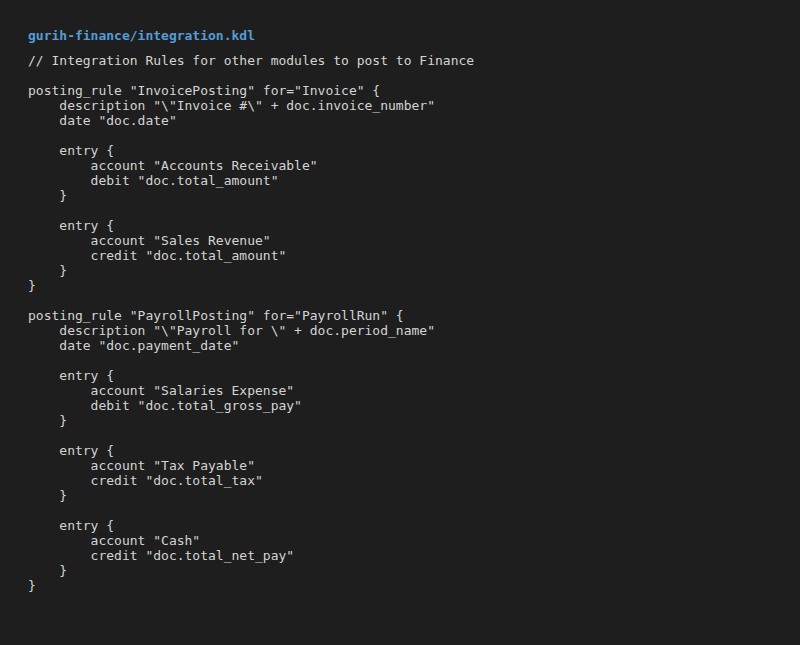

# GurihFinance Documentation

## 1. Overview

**GurihFinance** is the financial accounting module of the GurihERP suite. It provides a robust, double-entry bookkeeping system designed to be extensible and integrated with other operational modules (such as HR, Procurement, and POS).

Built on top of the **Gurih Framework**, it leverages a DSL-driven architecture to define its data models, accounting rules, and reporting structures. This ensures that financial policies are defined declaratively in code (`.kdl` files) rather than hardcoded in the application logic.

### Key Features
- **Double-Entry Ledger**: Ensures all transactions are balanced.
- **Configurable Chart of Accounts**: Hierarchical account structure.
- **Journal Entry Workflow**: Draft -> Posted (Immutable) lifecycle.
- **Automated Integration**: API for other modules to post transactions via `posting_rule`.
- **Flexible Reporting**: DSL-based query engine for Trial Balance, Balance Sheet, etc.

---

## 2. Architecture

GurihFinance follows the standard Gurih Framework architecture, separating the definition (DSL) from the execution (Runtime).

### Structure

The module is organized as a collection of KDL files that define the schema and behavior.


### Execution Model

1. **DSL Definition**: The schema is defined in `gurih.kdl` and included files (`coa.kdl`, `journal.kdl`).
2. **Compiler**: The `gurih_dsl` crate parses these files into an Intermediate Representation (IR).
3. **Runtime**: The `gurih_runtime` loads the IR.
4. **Plugin Logic**: The `FinancePlugin` (written in Rust) attaches to the runtime to enforce specific logic, such as:
   - Validating `balanced_transaction` on posting.
   - Performing period closing calculations.

### Runtime Output (Dashboard)

When the system runs, it loads the DSL and initializes the database and API endpoints automatically.


---

## 3. GurihFinance DSL

The core of GurihFinance is its DSL definitions.

### Chart of Accounts (`coa.kdl`)

Accounts are defined as entities with specific fields like `code`, `type`, and `normal_balance`.

```kdl
enum "AccountType" {
    Asset
    Liability
    Equity
    Revenue
    Expense
}

entity "Account" {
    field:pk id
    field:string "code" unique=#true
    field:string "name"
    field:enum "type" "AccountType"
    field:enum "normal_balance" "NormalBalance"

    // Using self-referencing relationship for hierarchy
    belongs_to "parent" entity="Account"
}
```

**UI Representation:**
The framework automatically generates the UI for managing accounts based on the entity definition.


### Journal Entries (`journal.kdl`)

Transactions are recorded as `JournalEntry` records containing multiple `JournalLine` items. The workflow is strictly controlled via DSL.


**Key Constructs:**
- `workflow "JournalWorkflow"`: Defines the state machine.
- `requires { balanced_transaction #true }`: Enforces that debits equal credits before posting.
- `state "Posted" immutable=#true`: Prevents editing once posted.

### Validation Rules

Rules enforce data integrity. For example, preventing deletion of accounts with existing entries:

```kdl
rule "PreventInUseAccountDelete" {
    on:delete "Account"
    assert "exists(\"JournalLine\", \"account\", self.id) == false"
    message "Cannot delete account that has journal entries."
}
```

---

## 4. End-to-End Example

### 1. Journal Entry Creation
A user creates a journal entry via the generated UI or API.


### 2. Posting
When the user attempts to post the journal, the `post` transition is triggered.

```kdl
    transition "post" {
        from "Draft"
        to "Posted"
        requires {
            balanced_transaction #true
            period_open entity="AccountingPeriod"
        }
    }
```

The `FinancePlugin` validates the `balanced_transaction` requirement. If `sum(debit) != sum(credit)`, the transition is rejected.

---

## 5. Integration Guide

Other modules (like `GurihSIASN` for Payroll or POS) integrate with Finance using **Posting Rules**.

### Posting Rules (`integration.kdl`)

Modules do not write to `JournalEntry` directly. Instead, they trigger a `posting_rule`.



**How it works:**
1. External module (e.g. Payroll) creates a source document (`PayrollRun`).
2. It triggers the posting rule (e.g., `post_journal "PayrollPosting"`).
3. The framework evaluates the expressions (`doc.total_gross_pay`) against the source document.
4. A balanced `JournalEntry` is automatically created and posted.
