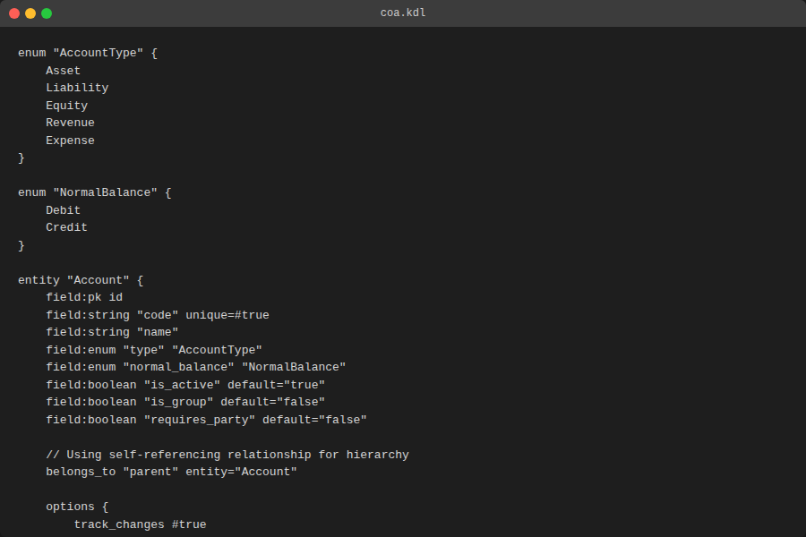

# GurihFinance Documentation

## 1. Overview

**GurihFinance** is the core financial module of the GurihERP ecosystem. It is designed to handle general ledger operations, financial reporting, and accounting compliance.

Unlike traditional ERPs where logic is hardcoded in controllers, GurihFinance is **DSL-driven**. This means the Chart of Accounts, Journal behaviors, and Reporting logic are defined in KDL configuration files, making the system highly adaptable without recompiling the core code.

### Role in GurihERP
GurihFinance acts as the central repository for financial data. Other modules (like Sales, Procurement, Payroll) do not write directly to the General Ledger. Instead, they submit transactions via **Posting Rules** defined in the DSL, ensuring separation of concerns and auditability.

---

## 2. Architecture

The system follows a strict separation between the **Definition** (DSL), the **Engine** (Gurih Framework), and the **Module Logic** (Plugin).

### Project Structure

```text
gurih-finance/
├── coa.kdl          # Chart of Accounts & Account Entity Definition
├── journal.kdl      # Journal Entry Entity, Workflow & Rules
├── period.kdl       # Accounting Periods & Closing Logic
├── reports.kdl      # Trial Balance & Financial Statements definitions
├── integration.kdl  # Rules for other modules to post journals
└── gurih.kdl        # Main configuration & Routing
```

### Execution Model

1.  **DSL Parsing**: The `gurih_dsl` crate parses the `.kdl` files into an AST.
2.  **Validation**: The framework validates schemas (e.g., entity relationships, formula correctness).
3.  **Runtime**: The `gurih_runtime` loads the entities into the database and generates the UI dynamically.
4.  **Plugin Logic**: The `FinancePlugin` (in Rust) handles complex logic like "Period Closing" or "Posting Validation" that cannot be expressed purely in DSL.

---

## 3. GurihFinance DSL

### 3.1 Chart of Accounts (`coa.kdl`)

Defines the structure of the General Ledger. It supports hierarchical accounts and strict typing.

**Key Features:**
*   `enum "AccountType"`: Defines Asset, Liability, Equity, Revenue, Expense.
*   `belongs_to "parent"`: Creates a self-referencing hierarchy for grouping accounts.

```kdl
entity "Account" {
    field:pk id
    field:string "code" unique=#true
    field:string "name"
    field:enum "type" "AccountType"
    field:boolean "is_group" default="false"

    // Hierarchical structure
    belongs_to "parent" entity="Account"
}

// Pre-defined Accounts
account "Cash" {
    code "101"
    type "Asset"
    normal_balance "Debit"
}
```




### 3.2 Journal Entries (`journal.kdl`)

Manages the transaction lifecycle. It uses a **Workflow** to control the state of a Journal Entry (Draft -> Posted).

**Double-Entry Validation:**
Rules enforce that total Debit must equal total Credit before posting.

```kdl
entity "JournalEntry" {
    field:serial "entry_number" serial_generator="JournalCode"
    field:enum "status" "JournalStatus" default="Draft"

    // Child table for line items
    has_many "lines" "JournalLine" type="composition"
}

workflow "JournalWorkflow" for="JournalEntry" field="status" {
    state "Draft" initial=#true
    state "Posted" immutable=#true

    transition "post" {
        from "Draft" to "Posted"
        requires {
            balanced_transaction #true
            period_open entity="AccountingPeriod"
        }
    }
}
```


### 3.3 Reports (`reports.kdl`)

Reports are defined using the `query:flat` DSL, which allows SQL-like projections and aggregations.

```kdl
query:flat "TrialBalanceQuery" for="Account" {
    params "start_date" "end_date"

    select "code"
    select "name"

    // Aggregation formulas
    formula "total_debit" "SUM([debit])"
    formula "total_credit" "SUM([credit])"

    join "JournalLine" {
        select "debit"
        select "credit"
    }

    group_by "code"
}
```

### 3.4 Accounting Periods (`period.kdl`)

Controls the fiscal year and locking of periods to prevent backdated entries.

```kdl
entity "AccountingPeriod" {
    field:date "start_date"
    field:date "end_date"
    field:enum "status" "PeriodStatus" default="Open" // Open, Closed, Locked
}

action "GenerateClosingEntry" {
    params "id"
    step "finance:generate_closing_entry" period_id="param(\"id\")"
}
```

---

## 4. End-to-End Example

### Scenario: Monthly Closing

1.  **Transaction Recording**: Users enter daily transactions via the Journal Entry form.

```kdl
// Example transaction data
{
    "entry_number": "JE/2026/01/0045",
    "description": "Office Rent Jan 2026",
    "lines": [
        { "account": "Rent Expense", "debit": 5000000 },
        { "account": "Cash", "credit": 5000000 }
    ]
}
```

2.  **Review**: The Finance Manager reviews "Draft" entries.

3.  **Posting**: Approved entries are transitioned to "Posted". The system validates that the `AccountingPeriod` is open.

```kdl
transition "post" {
    from "Draft" to "Posted"
    requires {
        period_open entity="AccountingPeriod"
    }
}
```

4.  **Reporting**: A `TrialBalanceReport` is generated to verify balances.

5.  **Closing**: The period is closed via the `GenerateClosingEntry` action.


---

## 5. Integration Guide

External modules integrate with Finance via **Posting Rules** defined in `integration.kdl`. This allows decoupling; the source module (e.g., Payroll) does not need to know about Account IDs, only logical definitions.

**Example: Payroll Integration**

```kdl
posting_rule "PayrollPosting" for="PayrollRun" {
    description "\"Payroll for \" + doc.period_name"
    date "doc.payment_date"

    entry {
        account "Salaries Expense"
        debit "doc.total_gross_pay"
    }

    entry {
        account "Tax Payable"
        credit "doc.total_tax"
    }

    entry {
        account "Cash"
        credit "doc.total_net_pay"
    }
}
```

The system ensures:
*   Immutability of the source document once posted.
*   Automatic creation of `JournalEntry` records.
*   Traceability back to the source `PayrollRun`.
