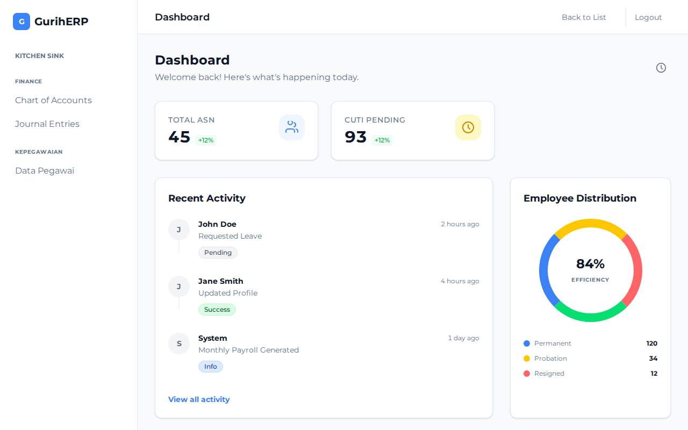
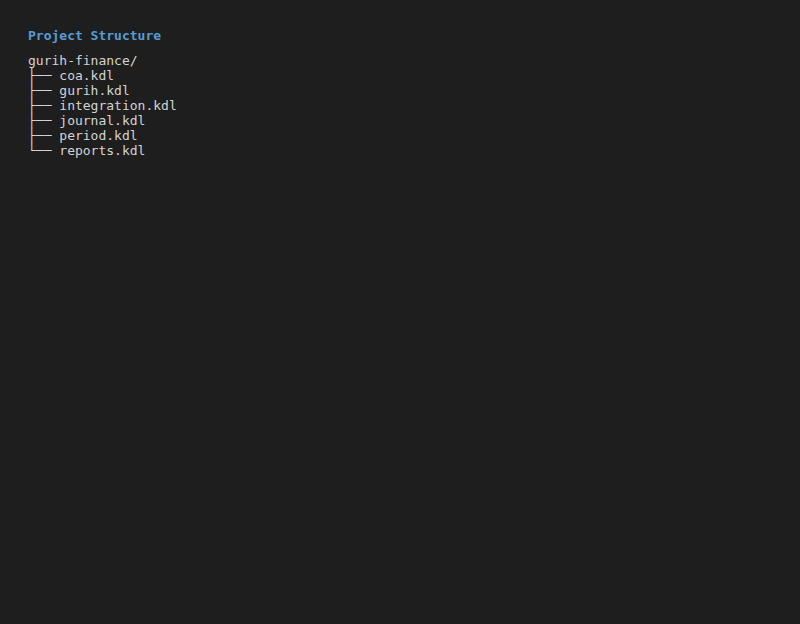
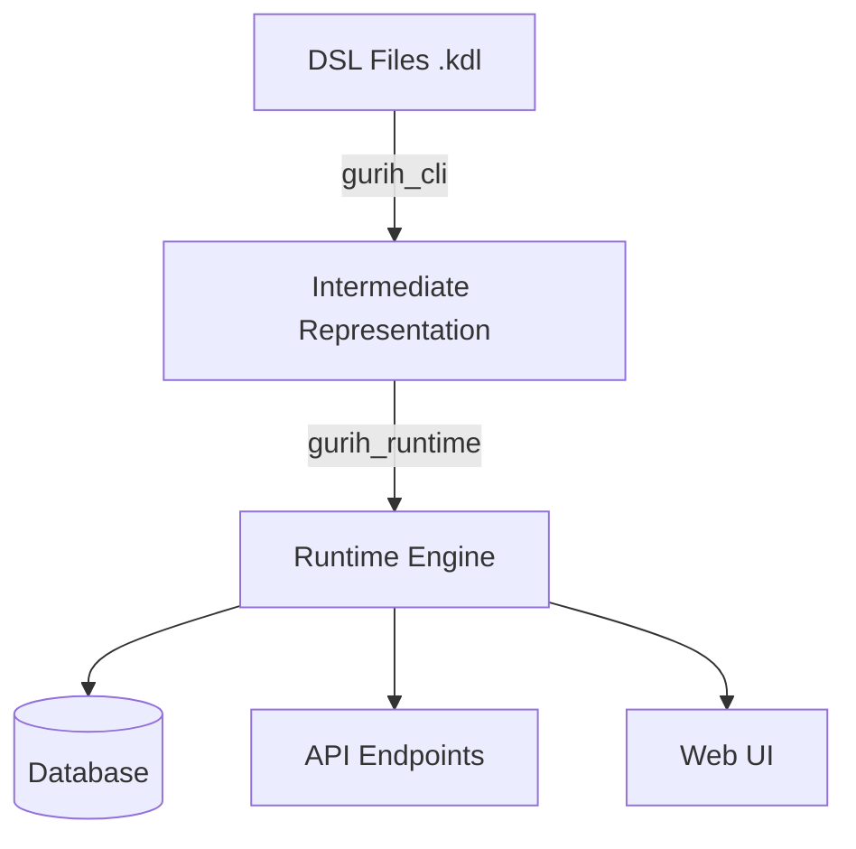
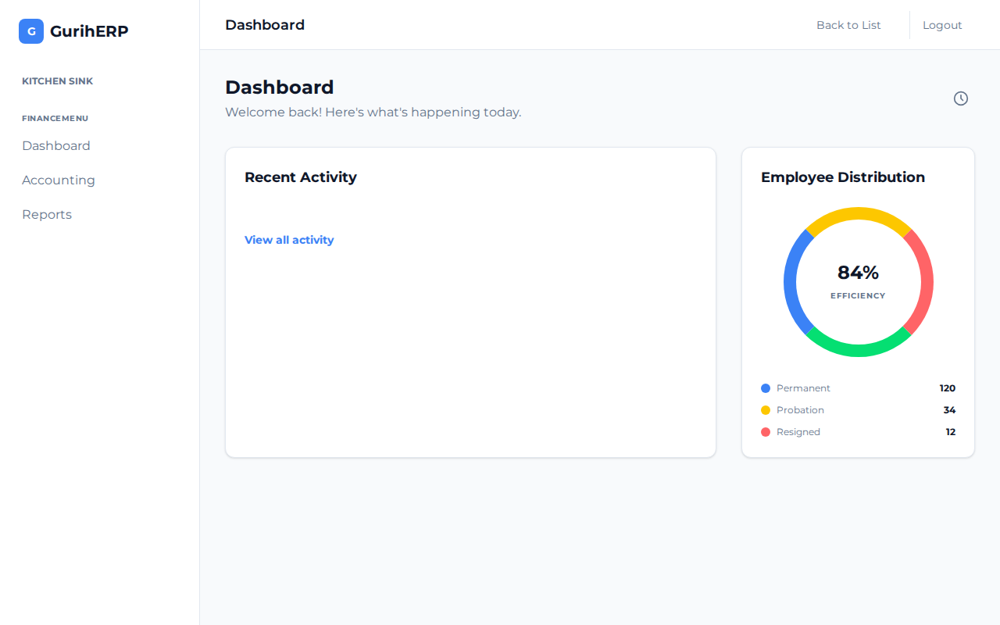
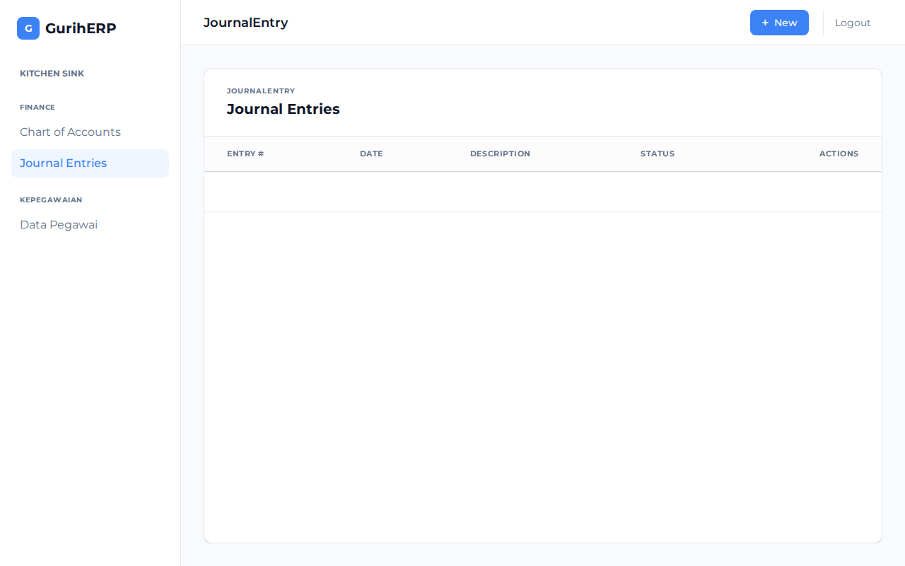

# GurihFinance Documentation

## 1. Overview

**GurihFinance** is the financial management module of the GurihERP suite. It is built using the **Gurih Framework**, leveraging a Domain-Specific Language (DSL) to define accounting rules, workflows, and reporting structures.

GurihFinance provides:
*   **Double-Entry Accounting**: Enforced via DSL rules.
*   **Flexible Chart of Accounts**: Hierarchical account structures.
*   **Automated Journal Posting**: Rules-based posting from other modules (e.g., HR, Sales).
*   **Financial Reporting**: Real-time generation of Balance Sheets and Income Statements.

It interacts with other modules like **GurihSIASN** (HR) through **Posting Rules**, which automatically translate business events (e.g., payroll runs) into journal entries.



## 2. Architecture

GurihFinance follows the standard **Gurih Framework** architecture, where business logic is defined in `.kdl` (KDL Document Language) files and executed by the **Gurih Runtime**.

### Project Structure

The module is organized as a collection of DSL files defining different aspects of the domain:



```text
gurih-finance/
├── gurih.kdl          # Main entry point (App definition, Menu, Routes)
├── coa.kdl            # Chart of Accounts definition
├── journal.kdl        # Journal Entry entity and workflows
├── period.kdl         # Accounting Periods
├── reports.kdl        # Financial Reports
└── integration.kdl    # Integration rules (Posting Rules)
```

### DSL Execution Model

1.  **Definition**: Developers define entities (e.g., `Account`), workflows, and rules in `.kdl` files.
2.  **Compilation**: The `gurih_cli` compiles these definitions into an Intermediate Representation (IR).
3.  **Runtime**: The `gurih_runtime` executes the IR, handling:
    *   Database Schema generation/migration.
    *   API endpoints (REST/GraphQL).
    *   Workflow state transitions.
    *   Rule validation.



## 3. GurihFinance DSL

### Chart of Accounts (CoA)

Defined in `coa.kdl`, the CoA uses the `entity` construct to define the `Account` structure and `account` keywords for seeding data.

**Key Features:**
*   **Hierarchical**: Accounts can have a `parent`.
*   **Type Safety**: Enforced via `AccountType` enum (Asset, Liability, etc.).

```kdl
// coa.kdl snippet
enum "AccountType" {
    Asset
    Liability
    Equity
    Revenue
    Expense
}

entity "Account" {
    field:pk id
    field:string "code" unique=#true
    field:string "name"
    field:enum "type" "AccountType"
    // ...
}
```



### Journal Entries & Workflows

Defined in `journal.kdl`, journal entries capture financial transactions.

**Transaction Lifecycle:**
1.  **Draft**: Editable state.
2.  **Posted**: Immutable state, affects balances. Requires `balanced_transaction` rule.
3.  **Cancelled**: Voided state.


```kdl
// journal.kdl snippet
workflow "JournalWorkflow" for="JournalEntry" field="status" {
    state "Draft" initial=#true
    state "Posted" immutable=#true

    transition "post" {
        from "Draft"
        to "Posted"
        requires {
            balanced_transaction #true
            period_open entity="AccountingPeriod"
        }
    }
}
```



### Accounting Periods

Defined in `period.kdl`, this manages the fiscal periods (e.g., Monthly).

**Key Features:**
*   **Status Control**: Periods can be `Open`, `Closed`, or `Locked`.
*   **Validation**: Journal posting checks if the period is `Open` via the `period_open` precondition in `JournalWorkflow`.

```kdl
// period.kdl
enum "PeriodStatus" {
    Open
    Closed
    Locked
}

entity "AccountingPeriod" {
    field:pk id
    field:string "name" // e.g. "Jan 2024"
    field:date "start_date"
    field:date "end_date"
    field:enum "status" "PeriodStatus" default="Open"
}
```

### Reports

Defined in `reports.kdl`, reports are generated using the `query` DSL construct.

**Key Features:**
*   **Parametrized Queries**: Accept `start_date` and `end_date`.
*   **Aggregations**: Use `formula` to calculate sums (e.g., `SUM([debit])`).
*   **Filtering**: Restrict data to "Posted" journals.

```kdl
// reports.kdl
query:flat "TrialBalanceQuery" for="Account" {
    params "start_date" "end_date"
    select "code"
    select "name"
    formula "total_debit" "SUM([debit])"
    formula "total_credit" "SUM([credit])"

    // Joins to JournalLine and JournalEntry...
    filter "[journal_entry.status] == \"Posted\""
}
```

### Rules and Validation

GurihFinance enforces strict accounting rules using the DSL `rule` construct.

*   **Positive Amounts**: Debits/Credits must be positive.
*   **Leaf Accounts**: Transactions can only be posted to non-group accounts.

```kdl
rule "LeafAccountOnly" {
    on "JournalLine:create"
    assert "lookup_field(\"Account\", account, \"is_group\") == false"
    message "Cannot post to a group account"
}
```

## 4. End-to-End Example

### 1. Defining an Account
An account is created via the API or UI.
```kdl
account "Cash" {
    code "101"
    type "Asset"
    normal_balance "Debit"
}
```

### 2. Creating a Journal Entry
A user creates a journal entry in `Draft` status for "Jan 2024".
*   Date: 2024-01-15
*   Debit: Cash (100)
*   Credit: Sales Revenue (100)

### 3. Posting the Journal
When the "Post" action is triggered:
1.  **Validation**: System checks if `Debit == Credit` (Balanced).
2.  **Period Check**: System checks if "Jan 2024" period is `Open`.
3.  **State Change**: Status changes to `Posted`.
4.  **Immutability**: Record becomes immutable.

### 4. Financial Report Generation
A user generates a **Trial Balance** for Jan 1, 2024 to Jan 31, 2024.
1.  The `TrialBalanceQuery` executes.
2.  It sums all debits and credits for "Posted" journals in that date range.
3.  The result shows "Cash" with Debit 100, "Sales" with Credit 100.

### 5. Period Closing
At the end of the month, the Finance Manager closes the period.
1.  Edit "Jan 2024" period.
2.  Set status to `Closed`.
3.  **Result**: No new journals can be posted to this period (due to `period_open` check).

## 5. Integration Guide

Other modules (like GurihSIASN) integrate with Finance using **Posting Rules** defined in `integration.kdl`.

### Posting Rules
Modules do not create Journal Entries directly. Instead, they define how their documents map to accounts using `posting_rule`.

**Example: Payroll Integration**
When a `PayrollRun` is approved in the HR module, the framework executes this rule:

```kdl
// integration.kdl
posting_rule "PayrollPosting" for="PayrollRun" {
    description "\"Payroll for \" + doc.period_name"
    date "doc.payment_date"

    entry {
        account "Salaries Expense"
        debit "doc.total_gross_pay"
    }

    entry {
        account "Tax Payable"
        credit "doc.total_tax"
    }

    entry {
        account "Cash"
        credit "doc.total_net_pay"
    }
}
```

### Error Handling
If a posting rule fails (e.g., Account not found, period closed):
1.  The transaction in the source module (e.g., Payroll) is rolled back.
2.  An error is returned to the user ("Payroll Period Closed").
