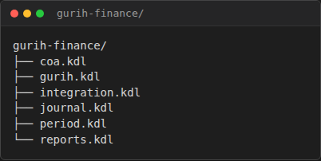
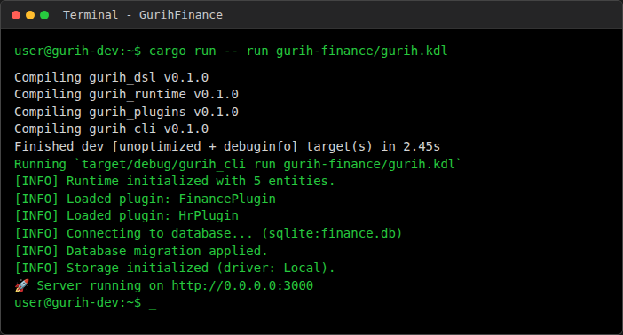

# GurihFinance Documentation

## 1. Overview

**GurihFinance** is the financial accounting module of the GurihERP suite. It provides a robust, double-entry bookkeeping system designed to be extensible and integrated with other operational modules (such as HR, Procurement, and POS).

Built on top of the **Gurih Framework**, it leverages a DSL-driven architecture to define its data models, accounting rules, and reporting structures. This ensures that financial policies are defined declaratively in code (`.kdl` files) rather than hardcoded in the application logic.

### Key Features
- **Double-Entry Ledger**: Ensures all transactions are balanced.
- **Configurable Chart of Accounts**: Hierarchical account structure.
- **Journal Entry Workflow**: Draft -> Posted (Immutable) lifecycle.
- **Automated Integration**: API for other modules to post transactions via `posting_rule`.
- **Flexible Reporting**: DSL-based query engine for Trial Balance, Balance Sheet, etc.

---

## 2. Architecture

GurihFinance follows the standard Gurih Framework architecture, separating the definition (DSL) from the execution (Runtime).

### Structure

The module is organized as a collection of KDL files that define the schema and behavior.



### Execution Model

1. **DSL Definition**: The schema is defined in `gurih.kdl` and included files (`coa.kdl`, `journal.kdl`).
2. **Compiler**: The `gurih_dsl` crate parses these files into an Intermediate Representation (IR).
3. **Runtime**: The `gurih_runtime` loads the IR.
4. **Plugin Logic**: The `FinancePlugin` (written in Rust) attaches to the runtime to enforce specific logic, such as:
   - Validating `balanced_transaction` on posting.
   - Performing period closing calculations.

### Runtime Output

When the system runs, it loads the DSL and initializes the database and API endpoints automatically.



---

## 3. GurihFinance DSL

The core of GurihFinance is its DSL definitions.

### Chart of Accounts (`coa.kdl`)

Accounts are defined as entities with specific fields like `code`, `type`, and `normal_balance`.


**Key Constructs:**
- `enum "AccountType"`: Asset, Liability, Equity, Revenue, Expense.
- `enum "NormalBalance"`: Debit, Credit.
- `entity "Account"`: Self-referencing entity for hierarchy.

### Journal Entries (`journal.kdl`)

Transactions are recorded as `JournalEntry` records containing multiple `JournalLine` items.

```kdl
entity "JournalEntry" {
    field:pk id
    field:serial "entry_number" serial_generator="JournalCode"
    field:date "date"
    field:enum "status" "JournalStatus" default="Draft"

    has_many "lines" "JournalLine" type="composition"
}

entity "JournalLine" {
    belongs_to "Account"
    field:money "debit" default=0
    field:money "credit" default=0
}
```

### Validation Rules

Rules enforce data integrity. For example, preventing deletion of accounts with existing entries:

```kdl
rule "PreventInUseAccountDelete" {
    on "Account:delete"
    assert "exists(\"JournalLine\", \"account\", self.id) == false"
    message "Cannot delete account that has journal entries."
}
```

---

## 4. End-to-End Example

### 1. Account Creation
A user (or seed script) creates an account via the API or UI.
- **Endpoint**: `POST /api/Account`
- **Payload**: `{ "code": "101", "name": "Cash", "type": "Asset", "normal_balance": "Debit" }`

### 2. Journal Entry
A draft journal entry is created.
- **Status**: `Draft`
- **Lines**:
    - Debit Cash 100
    - Credit Sales 100

### 3. Posting
The user triggers the `post` transition defined in the workflow.

```kdl
transition "post" {
    from "Draft"
    to "Posted"
    requires {
        balanced_transaction #true
        period_open entity="AccountingPeriod"
    }
}
```

The `balanced_transaction` precondition (implemented in `FinancePlugin`) ensures `sum(debit) == sum(credit)`. If valid, the status updates to `Posted`. Once posted, the record becomes immutable.

---

## 5. Integration Guide

Other modules (like `GurihSIASN` for Payroll) integrate with Finance using **Posting Rules**.

### Posting Rules (`integration.kdl`)

Modules do not write to `JournalEntry` directly. Instead, they trigger a `posting_rule`.

**Example: Payroll Integration**

```kdl
posting_rule "PayrollPosting" for="PayrollRun" {
    description "\"Payroll for \" + doc.period_name"
    date "doc.payment_date"

    entry {
        account "Salaries Expense"
        debit "doc.total_gross_pay"
    }

    entry {
        account "Tax Payable"
        credit "doc.total_tax"
    }

    entry {
        account "Cash"
        credit "doc.total_net_pay"
    }
}
```

**How it works:**
1. The Payroll module completes a `PayrollRun`.
2. It calls the `finance:post` action (mapped to `post_journal "PayrollPosting"` effect).
3. The framework evaluates the expressions (`doc.total_gross_pay`) against the source document.
4. A balanced `JournalEntry` is automatically created and posted.
