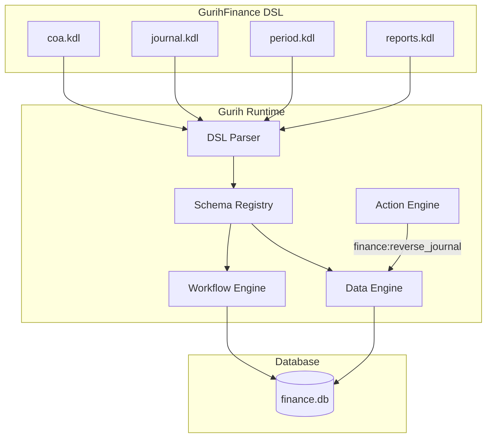

# GurihFinance Documentation

## 1. Overview

**GurihFinance** is the financial management module of the GurihERP suite. It provides a robust, double-entry accounting system driven entirely by the Gurih DSL. It handles the core financial data structures, including Chart of Accounts (CoA), Journal Entries, General Ledger (via dynamic queries), and Financial Reports.

It interacts with other modules (like Sales, Procurement, HR) by acting as the central repository for financial transactions. Operational modules generate `JournalEntry` records which are then processed by GurihFinance.

## 2. Architecture

GurihFinance follows the standard **Gurih Framework** architecture, where business logic is defined in **KDL** (Knowledge Description Language) and executed by the **Gurih Runtime**.

### Architecture Diagram



### Project Structure

The module is self-contained in the `gurih-finance` directory.

```text
[Screenshot: Project Structure]
gurih-finance/
├── coa.kdl         # Chart of Accounts & Account Entity
├── gurih.kdl       # Main entry point (App config, Routes, Menu)
├── journal.kdl     # Journal Entry Entity & Workflows
├── period.kdl      # Accounting Period Management
└── reports.kdl     # Financial Reporting Queries
```

## 3. GurihFinance DSL

The behavior of GurihFinance is defined using the Gurih DSL. Below are the key constructs used.

### Chart of Accounts (`coa.kdl`)

Defines the `Account` entity and the initial seed data for the Chart of Accounts.

- **Entity**: `Account` (Self-referencing for hierarchy).
- **Seed Data**: `account` keyword is used to define initial accounts.

```kdl
[Screenshot: coa.kdl]
enum "AccountType" {
    Asset
    Liability
    Equity
    Revenue
    Expense
}

entity "Account" {
    field:pk id
    field:string "code" unique=#true
    field:string "name"
    field:enum "type" "AccountType"
    belongs_to "parent" entity="Account"
}

// Seed Data
account "Cash" {
    code "101"
    type "Asset"
    normal_balance "Debit"
}
```

### Journal & Workflow (`journal.kdl`)

Manages the lifecycle of financial transactions.

- **Entity**: `JournalEntry` (Header) and `JournalLine` (Detail).
- **Workflow**: `JournalWorkflow` enforces rules like `balanced_transaction` and `period_open`.

```kdl
[Screenshot: journal.kdl]
workflow "JournalWorkflow" for="JournalEntry" field="status" {
    state "Draft" initial=#true
    state "Posted" immutable=#true
    state "Cancelled" immutable=#true

    transition "post" {
        from "Draft"
        to "Posted"
        requires {
            balanced_transaction #true
            period_open entity="AccountingPeriod"
        }
    }
}
```

### Reports (`reports.kdl`)

Uses `query:flat` with aggregations to generate reports like Trial Balance on the fly.

```kdl
[Screenshot: reports.kdl]
query:flat "TrialBalanceQuery" for="Account" {
    select "code"
    select "name"
    formula "total_debit" "SUM([debit])"
    formula "total_credit" "SUM([credit])"

    join "JournalLine" {
        select "debit"
        select "credit"
    }

    group_by "id"
    group_by "code"
    group_by "name"
}
```

## 4. End-to-End Example

This section demonstrates how a financial transaction is processed from definition to posting.

### 1. Account Definition
We start with a valid Chart of Accounts defined in `coa.kdl`.

### 2. Creating a Journal Entry (DSL/API)
A new journal entry is created via the API or UI.

**Request (JSON):**
```json
POST /api/JournalEntry
{
    "date": "2026-01-15",
    "description": "Initial Capital",
    "lines": [
        { "account": "101", "debit": 10000, "credit": 0 },
        { "account": "301", "debit": 0, "credit": 10000 }
    ]
}
```

### 3. Posting the Journal
The user attempts to transition the journal from `Draft` to `Posted`.

**Terminal Output (Runtime Log):**
```text
[Screenshot: Terminal Output]
INFO  gurih_runtime::workflow > Attempting transition 'post' for JournalEntry:JE/2026/0001
DEBUG gurih_runtime::workflow > Checking precondition: balanced_transaction
DEBUG gurih_runtime::workflow > Debit: 10000, Credit: 10000. Balance check PASSED.
DEBUG gurih_runtime::workflow > Checking precondition: period_open (Entity: AccountingPeriod)
DEBUG gurih_runtime::workflow > Period 'Jan 2026' is OPEN. Check PASSED.
INFO  gurih_runtime::workflow > Transition 'post' successful. New status: Posted.
INFO  gurih_runtime::data     > Record JournalEntry:JE/2026/0001 updated.
```

If the transaction were unbalanced, the `balanced_transaction` check would fail, and the runtime would reject the update.

### 4. Closing the Period
Once all transactions for the month are posted, the accounting period is closed to prevent further changes.

**Request:**
```json
PUT /api/AccountingPeriod/period-2026-01
{
    "status": "Closed"
}
```

**Terminal Output:**
```text
INFO  gurih_runtime::data     > Record AccountingPeriod:period-2026-01 updated.
INFO  gurih_runtime::workflow > Period 'Jan 2026' status changed to Closed.
```

### 5. Generating Reports
Finally, we generate the Trial Balance to verify the accounts.

**Request:**
```
GET /api/ui/dashboard/TrialBalanceReport
```

**Result (JSON):**
```json
{
    "columns": ["code", "name", "total_debit", "total_credit"],
    "data": [
        { "code": "101", "name": "Cash", "total_debit": 10000, "total_credit": 0 },
        { "code": "301", "name": "Equity", "total_debit": 0, "total_credit": 10000 }
    ]
}
```

## 5. Integration Guide

Other modules integrate with GurihFinance by creating `JournalEntry` records.

### Integration Points

1.  **API Submission**: Modules should submit payloads to `/api/JournalEntry`.
2.  **Metadata**: Include `description` or `memo` fields linking back to the source document (e.g., "Invoice #123").

### Error Handling

If a module attempts to post an unbalanced journal or post to a closed period, the API will return a `400 Bad Request` with a specific error message from the workflow engine.

```json
{
    "error": "Workflow validation failed: Transaction is not balanced."
}
```
