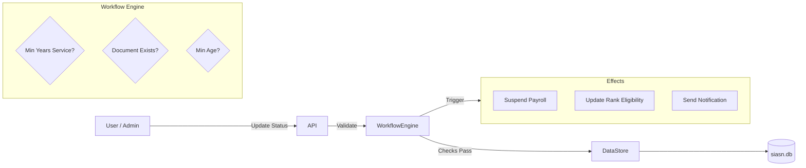

# GurihSIASN Documentation

## 1. Overview

**GurihSIASN** (Sistem Informasi ASN) is a comprehensive Human Resource Information System tailored for the Indonesian Civil Service (ASN). Built on the Gurih Framework, it manages the entire lifecycle of an employee, from CPNS (Candidate) to Pension, including promotions, mutations, awards, and leave management.

It utilizes a specialized DSL syntax for defining civil service workflows (`employee_status`), making complex bureaucratic rules easier to define and maintain.

## 2. DSL Usage in GurihSIASN

GurihSIASN leverages domain-specific DSL features to model HR rules.

### Employee Status Lifecycle (`workflow.kdl`)

Instead of a generic workflow, SIASN uses the `employee_status` block. This allows defining transitions specific to employment status, with domain-aware preconditions like `min_years_of_service` and `min_age`.

```kdl
[Screenshot: workflow.kdl]
employee_status "CPNS" for="Pegawai" field="status_pegawai" {
    can_transition_to "PNS" {
        requires {
             min_years_of_service 1 from="tmt_cpns"
             valid_effective_date "tmt_pns"
             document "sk_pns"
        }
        effects {
             update_rank_eligibility true
             notify "unit_kepegawaian"
        }
    }
}

employee_status "PNS" for="Pegawai" field="status_pegawai" {
    can_transition_to "Pensiun" {
        requires {
             min_age 58 from="tanggal_lahir"
        }
        effects {
             suspend_payroll true
             notify "taspen"
        }
    }
}
```

### Personnel Data (`kepegawaian.kdl`)

Defines the `Pegawai` entity and their historical records (`RiwayatJabatan`, `RiwayatUnor`). It uses rigorous data typing (e.g., `enum` for Gender, Religion) to ensure data quality.

```kdl
[Screenshot: kepegawaian.kdl]
entity "Pegawai" {
    field:pk id
    field:string "nip" unique=#true
    field:name "nama"
    field:enum "status_pegawai" "StatusPegawai"

    // Linked Histories
    has_many "riwayat_jabatan" "RiwayatJabatan"
    has_many "riwayat_unor" "RiwayatUnor"
}
```

### Leave Management (`cuti.kdl`)

A standard workflow example used for Leave Applications (`PengajuanCuti`).

```kdl
[Screenshot: cuti.kdl]
workflow "AlurCuti" for="PengajuanCuti" field="status" {
    state "Draft" initial="true"
    state "Diajukan"
    state "Disetujui"
    state "Ditolak"

    transition "setujui" {
        from "Diajukan"
        to "Disetujui"
    }
}
```

## 3. System Flow

The system behavior is driven by the interaction between the DSL definitions and the runtime engine.

### Runtime Flow Diagram



### Example: Pension Processing

1.  **Trigger**: HR Admin attempts to change a `Pegawai` status from `PNS` to `Pensiun`.
2.  **Validation**:
    -   Runtime looks up `min_age 58 from="tanggal_lahir"`.
    -   It calculates age based on `Pegawai.tanggal_lahir`.
    -   If Age < 58, the transition is blocked.
3.  **Execution**:
    -   If validation passes, status updates to `Pensiun`.
    -   **Effect**: `suspend_payroll true` is executed, updating the `is_payroll_active` flag on the entity automatically.

## 4. Comparison: GurihSIASN vs GurihFinance

While both modules run on the Gurih Framework, they utilize the DSL differently to solve their specific domain problems.

| Feature | GurihFinance | GurihSIASN |
| :--- | :--- | :--- |
| **Workflow Model** | Standard State Machine (`workflow`) | Domain-Specific (`employee_status`) + Standard (`workflow`) |
| **Key Invariants** | Accounting Equation (`balanced_transaction`) | Civil Service Rules (`min_years`, `min_age`) |
| **Reporting** | Aggregation Queries (`query:flat` with `sum`) | Flat Lists & Joins (`query:flat` with `select`) |
| **Data Nature** | Transactional (Journals) | Master Data & History (Riwayat) |
| **DSL Pattern** | Explicit state definitions | implicit "from" states in `employee_status` |

### Reusable Patterns

Future modules can learn from both:
-   Use **Standard Workflows** (like in Finance/Cuti) for document approval chains.
-   Use **Specialized DSL Macros** (like `employee_status`) when you have complex, repetitive business rules attached to a specific entity lifecycle.
