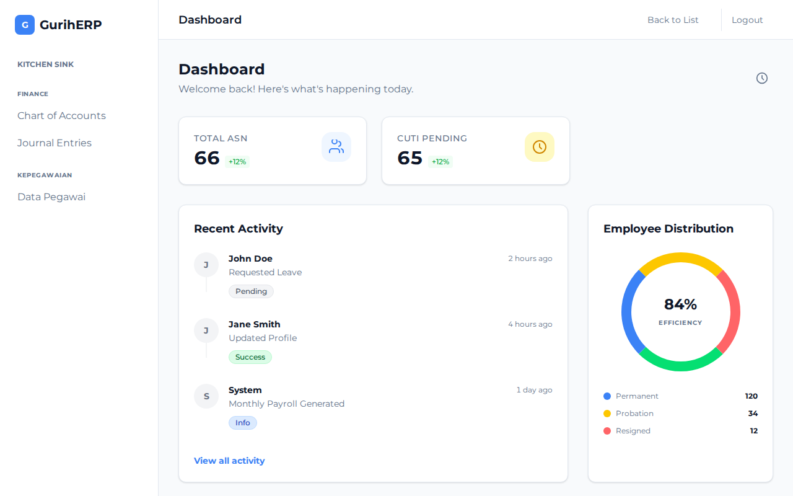
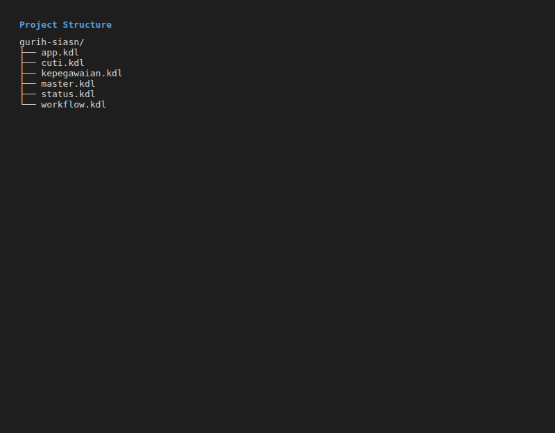
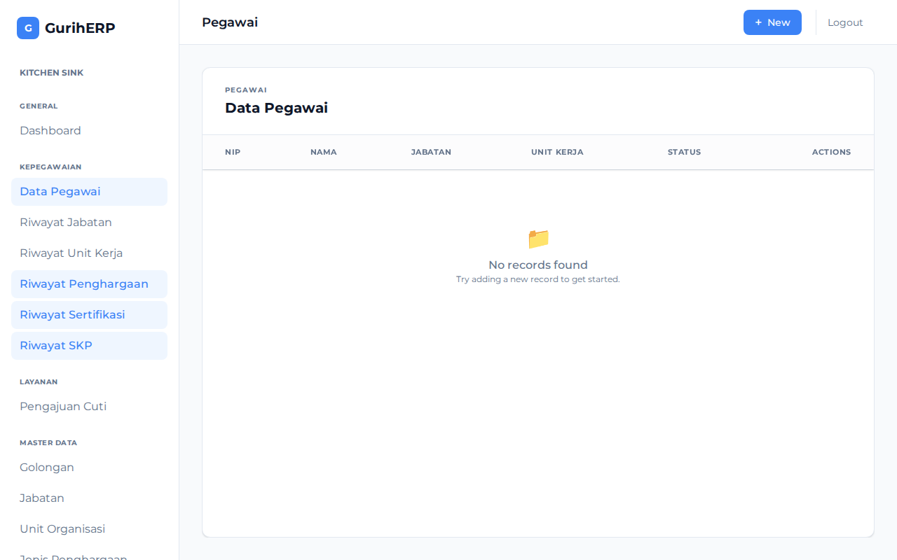
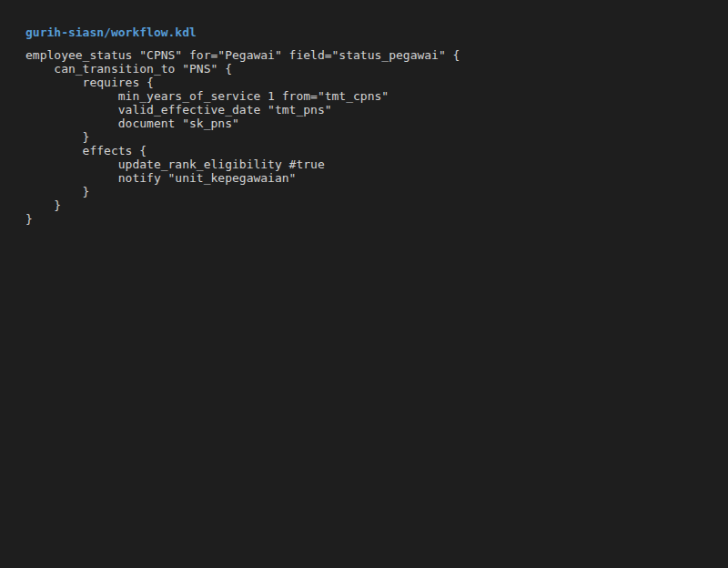

# GurihSIASN Documentation

## 1. Overview

**GurihSIASN** is a Human Resource Information System (HRIS) tailored for the Indonesian Civil Service (ASN). Built on the **Gurih Framework**, it manages employee lifecycle events, including recruitment, promotions, leave (Cuti), and retirement.

Target Users:
*   **ASN (Pegawai)**: Self-service for bio-data, leave requests, and document history.
*   **Admin/Kepegawaian**: Management of master data, approval workflows, and reporting.

Why DSL?
Using DSL allows regulations (which change frequently) to be updated in `.kdl` files without recompiling the core engine.



## 2. DSL Usage in GurihSIASN

GurihSIASN utilizes domain-specific DSL constructs to model complex HR relationships and workflows.

### Project Structure



```text
gurih-siasn/
├── app.kdl            # Main application entry, layouts, and role definitions
├── kepegawaian.kdl    # Core Employee (Pegawai) and History entities
├── cuti.kdl           # Leave management logic
├── workflow.kdl       # Approval workflows for various processes
└── master.kdl         # Master data (Golongan, Jabatan, Unor)
```

### Entity Modeling

Entities in SIASN often have complex history (Riwayat). This is modeled using `has_many` relationships.

```kdl
// kepegawaian.kdl
entity "Pegawai" {
    field:pk id
    field:string "nip" unique=#true
    field:name "nama"
    field:enum "status_pegawai" "StatusPegawai"

    // History tables
    has_many "riwayat_jabatan" "RiwayatJabatan"
    has_many "riwayat_unor" "RiwayatUnor"
}
```



### Employee Status Workflow

A specialized DSL construct `employee_status` is used to define transitions between employment states (e.g., CPNS to PNS). This abstracts away the complexity of generic workflows by providing domain-specific preconditions.

**Key Features:**
*   **Preconditions**: `min_years_of_service`, `document` (checks for file existence), `min_age`.
*   **Effects**: `suspend_payroll`, `update_rank_eligibility`.



```kdl
// workflow.kdl
employee_status "CPNS" for="Pegawai" field="status_pegawai" {
    can_transition_to "PNS" {
        requires {
             min_years_of_service 1 from="tmt_cpns"
             valid_effective_date "tmt_pns"
             document "sk_pns"
        }
        effects {
             update_rank_eligibility #true
             notify "unit_kepegawaian"
        }
    }
}
```

During compilation, this is desugared into a standard `workflow` with `transition` blocks, but utilizing the specialized syntax makes regulatory compliance easier to read and verify.

### Policies and Rules

Business rules, such as minimum age requirements, are defined declaratively.

```kdl
rule "MinAgeRule" {
    on "Pegawai:create"
    assert "age(tanggal_lahir) >= 18"
    message "Pegawai must be at least 18 years old"
}
```

## 3. System Flow

The behavior of GurihSIASN is strictly driven by the DSL definitions executed by the runtime.

### Flow Diagram: Data Update

1.  **User Action**: User submits a form (e.g., "Update Jabatan").
2.  **Validation**: Runtime checks `rule` definitions (e.g., Is the new Jabatan valid for the Golongan?).
3.  **Workflow**: If the change requires approval (defined in `workflow.kdl`), the record enters a "Draft" or "Pending" state.
4.  **Effect**: Upon approval, the `transition` effects apply the change to the `Pegawai` record and create a `RiwayatJabatan` entry.

### Status Transition Flow

For `employee_status` transitions:
1.  **Trigger**: Admin initiates a status change (e.g., "Angkat CPNS ke PNS").
2.  **Precondition Check**: The runtime verifies:
    *   Has the employee served > 1 year (`min_years_of_service`)?
    *   Is the SK PNS document uploaded (`document "sk_pns"`)?
3.  **Transition**: If checks pass, status updates to "PNS".
4.  **Effects**: Side effects run (e.g., `update_rank_eligibility` flag set to true).

### Runtime Behavior

Changes in DSL immediately reflect in the application behavior (with Hot Reload in dev mode).

*   **Adding a Field**: Adding `field:string "nik"` to `Pegawai` in `kepegawaian.kdl` automatically updates the database schema, API, and default UI forms.
*   **Changing a Workflow**: Modifying approval steps in `workflow.kdl` immediately changes the process flow.

## 4. Comparison: GurihSIASN vs GurihFinance

| Feature | GurihFinance | GurihSIASN |
| :--- | :--- | :--- |
| **Primary Domain** | Financial Accounting | Human Resources (Public Sector) |
| **Key Entities** | Account, JournalEntry | Pegawai, Riwayat, PengajuanCuti |
| **Workflow Focus** | Transaction State (Draft -> Posted) | Approval Chains & Status Lifecycle |
| **DSL Patterns** | `posting_rule` (Integration), `balanced_transaction` | `employee_status` (Lifecycle), `has_many` (History) |
| **Shared Core** | Both use Gurih Framework's `entity`, `page`, `workflow`, and `rule` constructs. | |

### Reusable Patterns

Future module developers can observe:
*   **Finance**: How to implement immutable ledgers and integration points.
*   **SIASN**: How to handle extensive data relationships (Histories), domain-specific workflow sugars (`employee_status`), and granular role-based permissions (`role "Pegawai"` vs `role "Admin"`).
