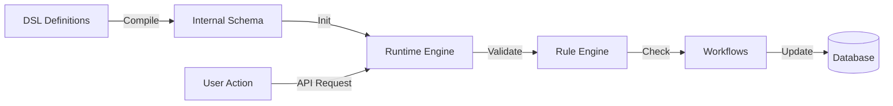

# GurihSIASN Documentation

## 1. Overview

**GurihSIASN** is a comprehensive Human Resource Information System (HRIS) designed for Civil Servants (ASN) in Indonesia. It is built using the Gurih DSL, enabling rapid adaptation to changing government regulations.

### Target Users
- **Administrator**: Manages master data (Golongan, Jabatan).
- **Pegawai (ASN)**: Views profile, requests leave, submits documents.
- **Approver**: Reviews leave requests and status changes.

### Why DSL?
Civil service rules (e.g., retirement age, promotion requirements) change frequently. Using DSL allows:
- **Policy as Code**: Rules like "Minimum 58 years for retirement" are defined in KDL, not hardcoded.
- **Workflow Agility**: Approval hierarchies can be modified without recompiling.

## 2. DSL Usage in GurihSIASN

GurihSIASN utilizes domain-specific DSL extensions for HR workflows.

### 2.1 Employee Management (`kepegawaian.kdl`)
The core entity is `Pegawai`. It links to various history tables (`Riwayat*`) to track career progression.

```kdl
entity "Pegawai" {
    field:pk id
    field:string "nip" unique=#true
    field:name "nama"
    field:enum "status_pegawai" "StatusPegawai" // CPNS, PNS, etc.

    // Histories
    has_many "riwayat_jabatan" "RiwayatJabatan"
    has_many "riwayat_unor" "RiwayatUnor"
}
```


### 2.2 Leave Management (`cuti.kdl`)
Handles leave requests with a state machine workflow.

```kdl
workflow "AlurCuti" for="PengajuanCuti" field="status" {
    state "Draft" initial="true"
    state "Diajukan"
    state "Disetujui"
    state "Ditolak"

    transition "ajukan" { from "Draft" to "Diajukan" }
    transition "setujui" { from "Diajukan" to "Disetujui" }
}
```


### 2.3 Status Transitions (`workflow.kdl`)
Complex rules for status changes (e.g., CPNS to PNS) are defined using `employee_status`.

```kdl
employee_status "CPNS" for="Pegawai" field="status_pegawai" {
    can_transition_to "PNS" {
        requires {
             min_years_of_service 1 from="tmt_cpns"
             valid_effective_date "tmt_pns"
             document "sk_pns"
        }
        effects {
             update_rank_eligibility #true
             notify "unit_kepegawaian"
        }
    }
}
```

## 3. System Flow

The system transforms these definitions into a runtime application.



### Runtime Behavior
1.  **Validation**: When a user creates a `Pegawai`, the `MinAgeRule` ensures they are >18 years old.
2.  **Transition**: When requesting a status change to "PNS", the engine checks `requires` blocks (e.g., is `sk_pns` uploaded?).
3.  **Effect**: Upon success, side effects (like notifications) are triggered automatically.

## 4. Comparison: GurihSIASN vs GurihFinance

| Feature | GurihFinance | GurihSIASN |
| :--- | :--- | :--- |
| **Primary Goal** | Accuracy & Auditability | Compliance & Workflow |
| **Core Entity** | `JournalEntry` (Immutable) | `Pegawai` (Mutable, Versioned) |
| **Workflow** | Rigid (Draft -> Posted) | Flexible (Draft -> Review -> Approved) |
| **Rules** | Math-heavy (Debit=Credit) | Policy-heavy (Age, Service Years) |
| **DSL Usage** | `posting_rule`, `query:flat` | `employee_status`, `document` |

### Shared Patterns
- **Entity Definition**: Both use standard `entity` and `field` definitions.
- **UI Generation**: Both rely on `page`, `form`, and `datatable` DSLs for frontend generation.
- **Security**: Both use `role` and `permission` logic.
