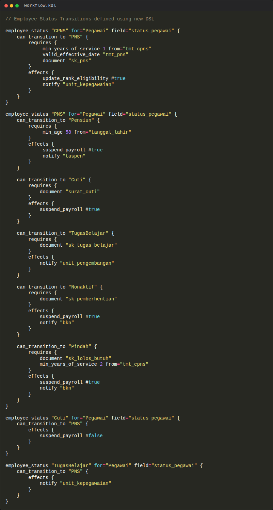

# GurihSIASN Documentation

## 1. Overview

**GurihSIASN** is the Human Resource Management Information System (HRIS) for ASN (Aparatur Sipil Negara) built on top of the Gurih Framework. It handles the full lifecycle of an employee, from CPNS entry, status changes, promotions, leaves (Cuti), to retirement (Pensiun).

### Target Audience
- **BKPSDM/BKN Administrators**: Manage master data and approvals.
- **ASN Employees**: View profile, submit leave requests.
- **Auditors**: Track history of jabatan and status changes.

### Why DSL?
The rules governing ASN management (e.g., BKN regulations) are complex and frequently changing. Using DSL allows:
- **Rapid Policy Updates**: Changing a minimum service year requirement is a one-line DSL change.
- **Auditability**: The rules are code, version-controlled, and human-readable.


## 2. DSL Usage in GurihSIASN

GurihSIASN leverages domain-specific DSL constructs alongside standard Gurih constructs.

### 2.1 Employee Management (`kepegawaian.kdl`)
Defines the core `Pegawai` entity and their historical data (Riwayat).

**Key Features:**
- **Rich Data Models**: `Pegawai` includes biographical data, documents (`sk_pns`), and relationships to `Jabatan` and `Unor`.
- **Historical Tracking**: "Riwayat" entities (e.g., `RiwayatJabatan`, `RiwayatUnor`) track career progression over time.

```kdl
entity "Pegawai" {
    field:string "nip" unique=#true
    field:name "nama"
    field:enum "status_pegawai" "StatusPegawai" // CPNS, PNS, Pensiun...

    // Relationships
    belongs_to "Jabatan"
    belongs_to "Unor" // Unit Organisasi

    // Document Attachments
    field:file "sk_pns" required=#false
}
```


### 2.2 Leave Management (`cuti.kdl`)
Handles the leave application process using a standard **Workflow**.

```kdl
workflow "AlurCuti" for="PengajuanCuti" field="status" {
    state "Draft" initial="true"
    state "Diajukan"
    state "Disetujui"
    state "Ditolak"

    transition "ajukan" { from "Draft" to "Diajukan" }
    transition "setujui" { from "Diajukan" to "Disetujui" }
}
```

### 2.3 Status Transitions (`status.kdl` & `workflow.kdl`)
This is where GurihSIASN shines. It uses a specialized `employee_status` DSL construct (syntactic sugar) to define complex BKN rules for status changes.



**Domain-Specific DSL (`status.kdl`):**
```kdl
employee_status "CPNS" for="Pegawai" {
    can_transition_to "PNS" {
        requires {
            min_years_of_service 1 from="tmt_cpns"
            document "sk_pns"
            valid_effective_date "tmt_pns"
        }
        effects {
            update_rank_eligibility "true"
            notify "unit_kepegawaian"
        }
    }
}
```

**Normalization:**
The framework compiles the above sugar into a standard `workflow` definition (visible in `workflow.kdl`), ensuring consistent execution by the core engine.

## 3. System Flow

### Runtime Behavior
1.  **DSL Definition**: Developers define rules in `.kdl`.
2.  **Compilation**: `gurih_dsl` parses `employee_status` and converts it to standard `TransitionDef`.
3.  **Execution**: When a user triggers a status change (e.g., CPNS -> PNS):
    *   **Preconditions Check**: The engine verifies `min_years_of_service` (calculated dynamically) and checks if `sk_pns` file is uploaded.
    *   **State Change**: If passed, `status_pegawai` updates to `PNS`.
    *   **Effects**: Side effects like `notify` or `update_rank_eligibility` are executed via `HrPlugin`.

### Flow Diagram

```mermaid
graph TD
    A[User Action: Promote CPNS to PNS] --> B{DSL Validator};
    B -- Check min_years_of_service --> C(Calculated from tmt_cpns);
    B -- Check Document --> D(sk_pns exists?);

    C & D --> E{Pass?};
    E -- Yes --> F[Update Database];
    F --> G[Run Effects (Notify)];
    E -- No --> H[Return Error];
```

## 4. Comparison: GurihSIASN vs GurihFinance

While both modules use the Gurih Framework, their usage of DSL differs to suit their domains.

| Feature | GurihFinance | GurihSIASN |
| :--- | :--- | :--- |
| **Primary Focus** | Transactional integrity & Balancing | Workflow logic & Regulatory compliance |
| **Key DSL Construct** | `account` (CoA), `query` (Reports) | `employee_status` (State Machine) |
| **Validation Style** | Math-heavy (Dr == Cr, Period Open) | Rule-heavy (Min Age, Documents, Time-in-grade) |
| **Reusable Patterns** | **Workflows**: Both use workflows for approvals (Journal Posting vs Cuti Approval).<br>**Entities**: Both use standard entity definitions. | Same. |
| **Plugins** | `FinancePlugin` (Posting logic) | `HrPlugin` (Status effects, specific checks) |

**Conclusion for Developers:**
When extending Gurih, you can create new domain-specific constructs (like `employee_status`) if the standard `workflow` syntax is too verbose for your domain experts, or stick to the standard DSL (like `journal.kdl`) for typical CRUD+Approval needs.
