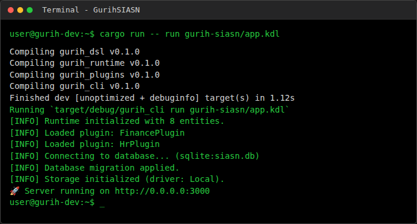

# GurihSIASN Documentation

## 1. Overview

**GurihSIASN** (Sistem Informasi ASN) is the Human Resources management system for the Indonesian State Civil Apparatus (ASN), built on the Gurih Framework.

It manages the entire lifecycle of civil servants, from onboarding (CPNS) to retirement (Pensiun), including promotions, transfers, and leave management.

### Target Audience
- **Admin**: Manages master data (Jabatan, Golongan) and system configuration.
- **ASN (Pegawai)**: Views profile, requests leave, submits documents.
- **Auditor**: Reviews personnel history and compliance.

---

## 2. DSL Usage in GurihSIASN

GurihSIASN utilizes specific DSL extensions to model HR complexity, particularly around employee status transitions.

### Employee Status DSL

Instead of generic state machines, SIASN uses the `employee_status` block to define the lifecycle of a `Pegawai`.

**Key Components:**
- **requires**: Preconditions like `min_years_of_service`, `min_age`, or `document` existence.
- **effects**: Side effects triggered upon transition.
  - `suspend_payroll`: Custom HR effect to stop salary payments.
  - `update_rank_eligibility`: Flags the employee for promotion.
  - `notify`: Sends notifications to external systems (Taspen, BKN).

### Domain-Specific Keywords

The DSL parser supports HR-specific keywords that translate to underlying framework actions:

| DSL Keyword | Framework Action | Purpose |
|-------------|------------------|---------|
| `suspend_payroll #true` | `UpdateField(is_payroll_active, false)` | Stops payroll for unpaid leave/suspension. |
| `update_rank_eligibility #true` | `UpdateField(rank_eligible, true)` | Marks employee as eligible for rank promotion. |

---

## 3. System Flow

### Runtime Execution

1. **DSL Loading**: The `app.kdl` and `workflow.kdl` files are loaded.
2. **Plugin Initialization**: The `HrPlugin` initializes and registers handlers for the custom effects (`suspend_payroll`).
3. **Transition Request**:
   - A user requests to move a `Pegawai` from `PNS` to `Pensiun`.
4. **Validation**:
   - Framework checks `min_age 58`.
   - If `age < 58`, the transition is rejected.
5. **Execution**:
   - Status updates to `Pensiun`.
   - `suspend_payroll` effect is executed, setting `is_payroll_active = false` in the database.
   - `notify "taspen"` sends a message to the pension system.

### Runtime Output

---

## 4. Comparison: GurihSIASN vs GurihFinance

While both modules use the Gurih Framework, they differ in their usage patterns.

| Feature | GurihFinance | GurihSIASN |
|---------|--------------|------------|
| **Core Entity** | `JournalEntry` (Immutable Ledger) | `Pegawai` (Mutable State Machine) |
| **Logic Focus** | Mathematical balance, integrity | Workflow rules, time-based eligibility |
| **DSL Style** | `rule`, `posting_rule` (declarative mapping) | `employee_status` (lifecycle definition) |
| **Validation** | `balanced_transaction` (strict equality) | `min_years_of_service`, `document` (policy checks) |

### Reusable Patterns

Both modules share:
- **`workflow`**: State transitions.
- **`dashboard`**: Widget definitions for UI.
- **`role`**: RBAC permissions.
- **`report/query`**: Data extraction logic.
